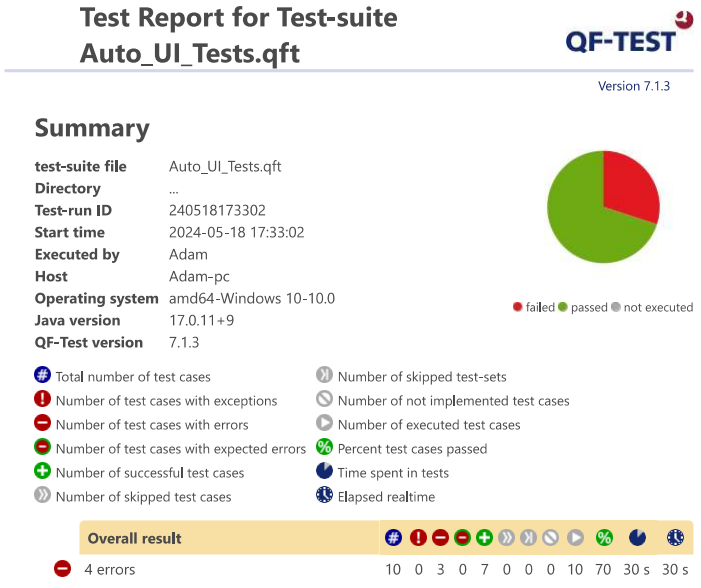

# Auto UI testing feladat leírása

Az automata UI tesztelést a QF-Test nevű alkalmazással valósítottam meg,mert Java Swinget is tud tesztelni, illetve egyszerű a használata. 

Alább látható a tesztek lefutásának eredménye. Látszik, hogy talált hibát a rendszer.

Tapasztalatok: Használata kényelmes az alkalmazásnak, bár pl a Gomb-nál nem lehet a tulajdonságokra keresni, csak pl. a Text propertyre. Ha pl. a borderre vagyunk kíváncsiak (hogy megnézzük, hogy egy pipe eltört-e pl.), akkor csak az image alapján kereshetünk. Ezt kényelmesen megtehetjük, ha az alkalmazásunk működik már (akár a pipe kép egyezését vizsgálhatjuk vagy akár csak néhány pixelét). Ebből viszont az következik, hogy ha az alkalmazásunk még gyerekcipőben jár, akkor nem látjuk még, hogy milyennek kéne kinéznie, és ekkor még tesztet sem tudunk így csinálni.

Következtetésképp arra jutottam, hogy akkor érdemes ezt az ellenőrzés típust végezni, ha azt szeretnék vizsgálni, hogy már egy működő UI elem nem változik meg egyéb más funkciók megvalósítása esetén. De ekkor is valószínű, hogy változtatni kell a tesztjeinkem.

Egy nem dinamikus, főleg fix adatokat tartalmazó alkalmazás esetén viszont jól működhet ez a tesztelési forma.

